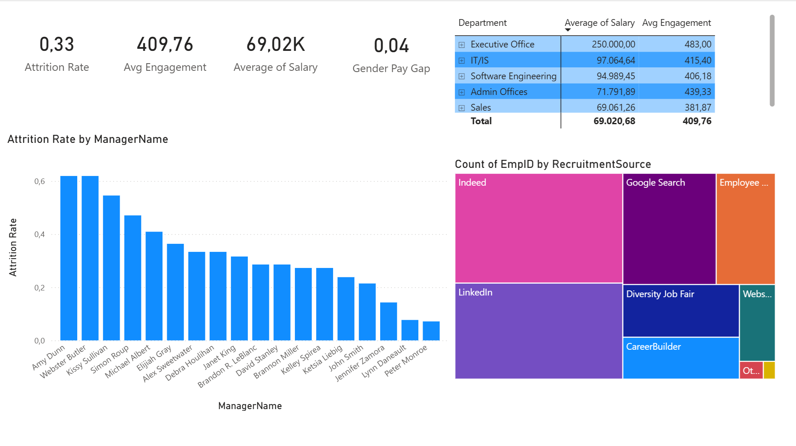
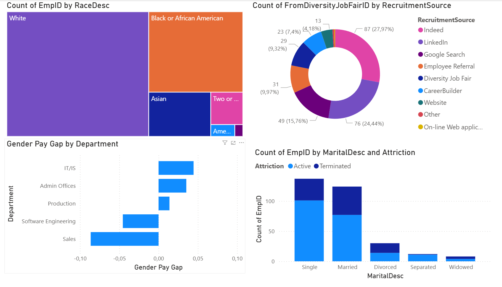

# HR Behavioral Analytics: Decoding Turnover & Burnout
### Project by Lorenzo Di Salvatore  
Work and Organizational Psychology | HR Data Analytics Specialist


---

## Executive Summary

Why do employees really leave? Most HR reports stop at "what" happened. This project investigates the "why" by applying psychological theory to the HR Dataset v14 (1,470 records).

By bridging raw data and organizational behavior, I transitioned from descriptive reporting to **Organizational Diagnostics**, identifying invisible risks like high-performer burnout and localized leadership toxicity.

### Key Findings

- **The Absence Paradox:** High performers aren't just working hard; they are exhausted. They show higher absence rates (10.5 days) than low performers (8.3 days).  
- **Micro-Climate Toxicity:** Attrition is not systemic; it is localized. Two specific managers drive ~62% of team turnover.  
- **The Hygiene Factor Gap:** "Unhappiness" (Culture) is a stronger driver of exits than "More Money" (Compensation).  

---

## Visual Analysis and Organizational Diagnostics

---

### Executive Workforce Snapshot


(Dashboard Overview)

**What data shows**  
• Attrition Rate: 33%  
• Avg Engagement: 4.09  
• Avg Salary: 69K  
• Gender Pay Gap Index: 0.04  

**Business Meaning**  
Attrition concentration appears at manager level, not company level.

---

### Managerial Risk Concentration

(Contained in dashboard overview)

**Observation**  
Two managers exceed 60% attrition while most stay below 20%.

**Business Meaning**  
Turnover links strongly to leadership quality.

**Action**  
Target leadership coaching before launching global retention programs.

---

### Recruitment Channel Distribution

(Contained in dashboard overview)

**Observation**  
Indeed and LinkedIn generate most hires.

**Risk**  
High dependency on few external talent pipelines.

---

### Workforce Composition and DEI Context


(DEI Overview)

**Population Distribution**  
Majority White workforce, followed by Black or African American and Asian employees.

**Why This Matters**  
Population structure must be evaluated before interpreting pay gap or attrition variance.

---

### Gender Pay Gap by Department

(Contained in DEI overview)

**Observation**  
• Sales favors female salary levels  
• IT/IS favors male salary levels  

**Root Driver**  
Salary correlates 0.51 with SpecialProjectsCount.  
Unequal access to high-visibility projects likely influences pay distribution.

---

### Attrition by Life Context

(Contained in DEI overview)

**Observation**  
Higher termination counts in Single and Married groups reflect workforce composition.

**Use Case**  
Validates attrition models against demographic distribution.

---

### Termination Reasons: Culture vs Market


**What data shows**  
• Another Position ranks first  
• Unhappy ranks second  
• More Money ranks third  

**Business Meaning**  
Cultural dissatisfaction drives exits more than compensation alone.

**Analysis**  
"Unhappy" (14 cases) is a stronger exit driver than "More Money" (11 cases). This signals a breakdown in the organizational climate and requires cultural intervention rather than broad pay adjustments.

---

### Burnout Risk Detection


**What data shows**  
High performers record highest absence averages.

**Business Meaning**  
Early burnout indicator, not disengagement.

**Analysis**  
Top performers ("Exceeds") have higher absence rates (10.5 days) than low performers (8.3 days). These employees are over-extending themselves, using absences to cope before potential resignation. This is a **Leading Indicator of Burnout**.

---

### Structural Pay Equity Pattern


**What data shows**  
Pay variance exists at department level, not company level.

**Analysis**  
The IT/IS pay gap correlates 0.51 with `SpecialProjectsCount`. This suggests unequal access to high-visibility projects drives the variance rather than direct salary bias.

---

### Data Engineering Layer (Python)

Tools  
• kagglehub  
• pandas  
• seaborn  
• matplotlib  

Work Completed  
• Automated dataset ingestion  
• Removed trailing whitespace in categorical columns  
• Created binary Attrition variable  
• Built correlation models between workload, salary, and absence  

---

### Business Intelligence Layer (Power BI)

Goal: Convert statistical output into decision interface.

#### Core DAX Measure

```dax
Attrition Rate =
DIVIDE(
    CALCULATE(COUNTROWS('HR_Data'),
    'HR_Data'[Status] = "Terminated"),
    COUNTROWS('HR_Data'),
    0
)
```

Other Measures  
• Gender Pay Gap Index  
• Manager Attrition Risk Ranking  
• Workforce Engagement Index  

---

### Dashboard Decision Flow

Executive Layer  
• Attrition KPI  
• Engagement KPI  
• Salary KPI  

Diagnostic Layer  
• Burnout Signals  
• Termination Drivers  

Root Cause Layer  
• Manager Attrition Ranking  
• Department Pay Equity  

---

## Strategic Actions

### Leadership Intervention
Focus on highest attrition managers first.

### Burnout Early Warning
Flag employees with:
Performance > 4  
Absences > 10  

Treat as retention risk group.

### Project Allocation Audit
Review Special Project assignment distribution inside IT.

---

## Business Value

Python identifies statistical relationships.  
Power BI translates results into operational decisions.

Outcome: shift from reactive hiring to predictive retention strategy.

---

## Author

Lorenzo Di Salvatore  
HR Analytics | Organizational Psychology | People Data Strategy
* LinkedIn: [Lorenzo Di Salvatore](https://www.linkedin.com/in/lorenzo-di-salvatore-psico)
* Portfolio: [GitHub Repositories](https://github.com/LoreBear)

