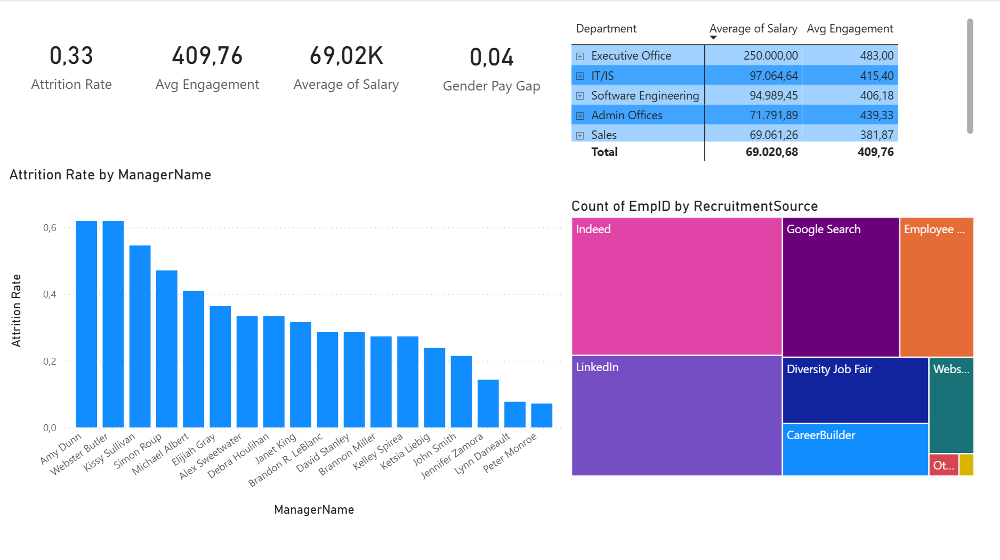
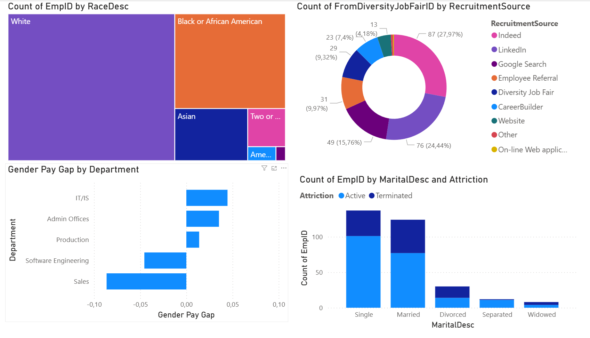
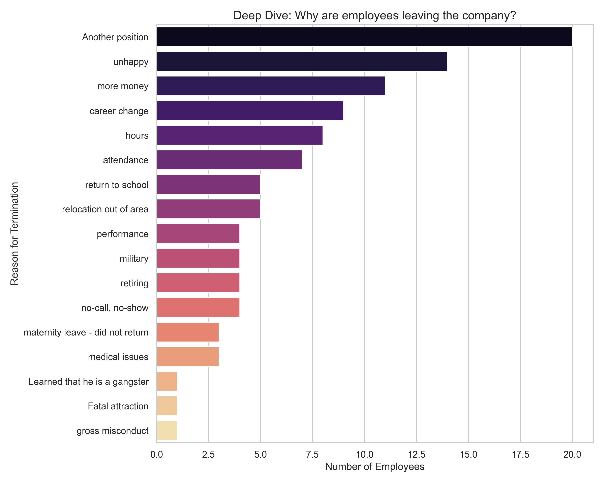
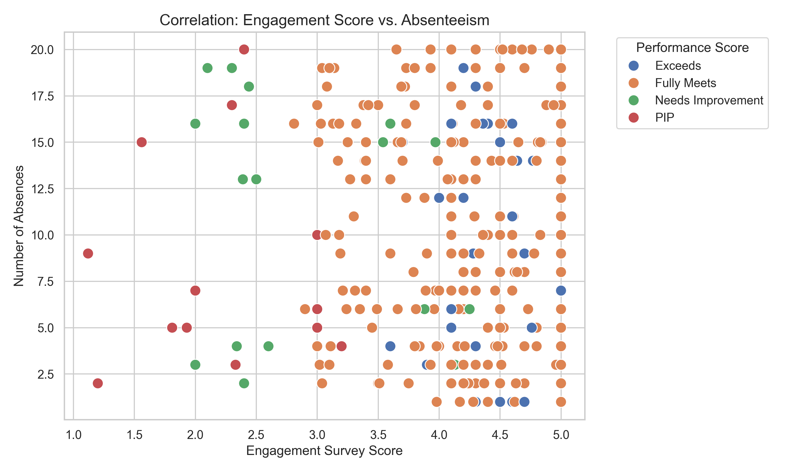
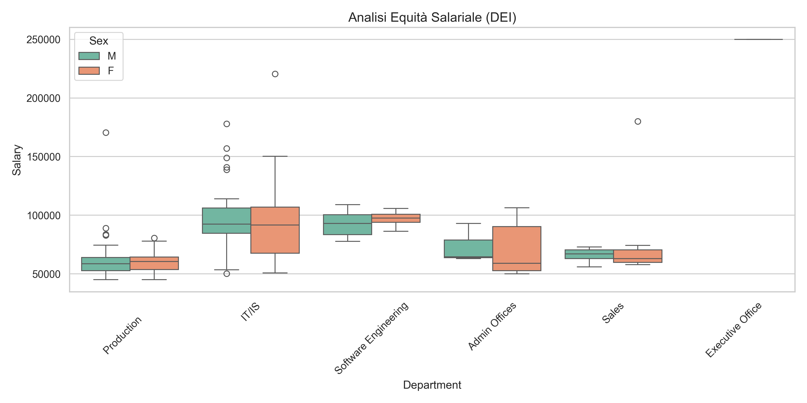

# HR Behavioral Analytics: Decoding Turnover & Burnout
### Project by Lorenzo Di Salvatore
Work and Organizational Psychology | HR Data Analytics Specialist


---

## Project Overview: The Organizational "Biopsy"

Why do employees really leave? In traditional HR, attrition is often treated as a turnover statistic — a number to report, not a signal to decode. Through the lens of Work & Organizational Psychology, attrition is a symptom of systemic friction: breaches of the psychological contract, leadership failures, and invisible burnout accumulating beneath the surface of performance data.

As Rousseau (1989) established, the psychological contract — the unwritten set of expectations between employee and employer — is the invisible architecture of the employment relationship. When it fractures, no compensation adjustment will rebuild it. This project analyzes the **HR Dataset v14 (311 employee records)** to perform **Organizational Diagnostics**, identifying the behavioral and structural drivers that raw numbers consistently fail to surface.

**Dataset:** HR Dataset v14 (Kaggle — rhuebner/human-resources-data-set)
**Tools:** Python (Pandas, Seaborn, Matplotlib) · Power BI (DAX, Power Query)
**Overall attrition rate:** 33% — one in three employees has left the organization

---

## Executive Summary: Diagnostic Findings

Attrition is rarely about pay alone. The data reveals a complex interplay of leadership quality, workload, and emotional exhaustion converging into three organizational paradoxes:

| # | Paradox | Finding |
|---|---------|---------|
| 1 | The Absence Paradox | Top performers ("Exceeds") have *higher* absence rates (10.5 days) than low performers (8.3 days) |
| 2 | Micro-Climate Toxicity | Two managers drive ~62% attrition within their teams; company average sits below 33% |
| 3 | Culture over Cash | "Unhappy" (14 exits) outranks "More Money" (11 exits) as a reason for leaving |

---

## Core Organizational Paradoxes

### 1. The Absence Paradox (Burnout Detection)

- **What the data shows:** Absence rates by performance group reveal a non-linear pattern: *Needs Improvement* employees average **11.3 days** absent, *Exceeds* employees average **10.5 days**, *Fully Meets* average **10.2 days**, and employees on a PIP (Performance Improvement Plan) average the lowest at **8.3 days**. Two structurally opposite dynamics are visible in the same metric.
- **Psychologist's Take:** The PIP group's low absence rate is not a sign of engagement — it reflects the behavioral effect of heightened scrutiny. Employees under formal review suppress discretionary absence because the perceived cost of absence is elevated. At the other end, *Needs Improvement* and *Exceeds* employees both show elevated absences, but for entirely different reasons. For *Needs Improvement*, elevated absenteeism is a classic disengagement signal — withdrawal from an environment that feels unrewarding. For *Exceeds* employees, the mechanism is the opposite: Maslach & Jackson (1981) defined burnout as *"a syndrome of emotional exhaustion, depersonalization, and a sense of reduced personal accomplishment,"* and the high-absence / high-performance profile is its early fingerprint. These employees are over-extending themselves, using absenteeism as a coping mechanism before eventual resignation. The same number — high absence — points to two completely different interventions depending on the performance context. This is precisely what makes absence rate a **leading indicator** rather than a simple disengagement proxy.

### 2. Micro-Climate Toxicity vs. Company Culture

- **What the data shows:** Two managers exceed **62% attrition** within their teams, while most managers sit below 30%. This is not a company-wide problem — it is geographically precise.
- **Psychologist's Take:** Gallup (2015) found that *"managers account for at least 70% of the variance in employee engagement scores across business units."* Beyond engagement, Harter, Schmidt & Hayes (2002) demonstrated in a meta-analysis of 7,939 business units that manager-level dynamics are the primary mediator between organizational policy and individual behavior. Localized leadership behavior creates **organizational micro-climates** that can anchor or repel talent independently of company-wide benefits, culture programs, or pay levels. A retention strategy applied at the organizational level will have near-zero effect on teams experiencing managerial toxicity. The intervention must be surgical, not systemic.

### 3. The Hygiene Factor Gap: Culture over Cash

- **What the data shows:** "Unhappy" ranks as the second most common exit reason (14 cases), ahead of "More Money" (11 cases). "Another Position" leads at 20 cases — but the decision to look is typically made before the offer arrives.
- **Psychologist's Take:** Herzberg, Mausner & Snyderman (1959) established that adequate salary prevents dissatisfaction but does not drive loyalty. As Herzberg (1966) wrote, *"the opposite of job satisfaction is not job dissatisfaction, but rather no job satisfaction."* When "Unhappy" outranks "More Money" as an exit driver, the organization is facing a breakdown in emotional fulfillment — a breach of the psychological contract (Rousseau, 1989) between employee and employer. A pay raise applied to a cultural problem is not a solution; it is a delay.

---

## Visual Analysis and Organizational Diagnostics

---

### Executive Workforce Snapshot



**What the data shows**
- Attrition Rate: **33%** — one in three employees has left
- Avg Engagement Score: **4.11** (scale 1–5)
- Average Salary: **$69K**
- Gender Pay Gap Index: **0.04** — low at company level, but uneven across departments

**Business Meaning**
The headline numbers mask the real story. A 33% attrition rate distributed unevenly across managers means a blanket retention program would waste resources protecting teams that don't need it, while leaving the highest-risk micro-climates untouched. As Mitchell et al. (2001) demonstrated, retention is a function of embeddedness — the density of links between an employee and their immediate organizational context — not company-level sentiment scores.

---

### Managerial Risk Concentration

*(Contained in Dashboard Overview)*

**What the data shows**
- Amy Dunn and Webster Butler: **>60% attrition** within their teams
- Majority of managers: below 30%
- The distribution is sharply right-skewed — this is not statistical noise

**Business Meaning**
Attrition is not a company-wide disease. It is a localized infection under two specific leaders. Gallup (2015) observed that *"the single biggest decision you make in your job — bigger than all the rest — is who you name manager."* This finding reframes the entire retention strategy: before launching engagement surveys or culture programs, the organization must ask a more targeted question — *what is happening inside those two teams?*

**Action**
Initiate a structured leadership review for high-attrition managers before deploying any global retention investment.

---

### Recruitment Channel Distribution

*(Contained in Dashboard Overview)*

**What the data shows**
- Indeed: **27.97%** of hires
- LinkedIn: **24.44%**
- Google Search and Employee Referral follow

**Business Meaning**
Over 50% of recruitment volume is concentrated in two external platforms. This is an operational risk: any algorithm change, pricing shift, or platform disruption directly impacts talent pipeline continuity. Research on recruitment source effects (Zottoli & Wanous, 2000) consistently shows that employee referrals produce higher retention rates and faster time-to-productivity — suggesting that diversifying toward internal sourcing channels would improve both pipeline resilience and downstream retention outcomes.

---

### Workforce Composition and DEI Context



**What the data shows**
- Majority White workforce, followed by Black or African American and Asian employees
- Recruitment sources show meaningful Diversity Job Fair representation (9.32%)
- Marital status distribution: Single and Married groups are largest by headcount

**Business Meaning**
Population structure is the prerequisite to any equitable analysis. As Nkomo & Cox (1996) argued, demographic diversity data must be interpreted within its structural context — workforce composition shapes both the numerator and denominator of any disparity metric. Attrition or pay variance interpreted without this baseline creates misleading conclusions and risks attributing structural patterns to individual-level causes.

---

### Gender Pay Gap by Department

*(Contained in DEI Overview)*

**What the data shows**
- IT/IS: pay gap favors male salary levels
- Admin Offices: pay gap favors male salary levels
- Sales: pay gap favors female salary levels
- Production and Software Engineering: near parity

**Business Meaning**
The pay gap is not a company-level phenomenon — it is department-specific, which is the analytically significant finding. A company-wide Gender Pay Gap Index of 0.04 would normally signal equity. But department-level disaggregation reveals structural inequality hidden inside the average.

**Root Driver**
Salary correlates **0.51 with `SpecialProjectsCount`**. The IT/IS gap aligns with what Castilla (2008) termed *"performance reward bias"* — a pattern in which access to high-visibility assignments becomes the primary determinant of long-term compensation trajectory, independent of base pay policy. Closing the gap at the base pay level treats the symptom; auditing project assignment processes treats the cause.

---

### Termination Reasons: Culture vs. Market



**What the data shows**
- Another Position: **20 exits** — the leading reason
- Unhappy: **14 exits** — second place
- More Money: **11 exits** — third place
- Hours, Career Change, Attendance follow

**Business Meaning**
The ranking of "Unhappy" above "More Money" directly confirms Herzberg's (1959) two-factor model at the organizational level: cultural dissatisfaction is a stronger and more prevalent exit driver than compensation inadequacy.

**Analysis**
"Another Position" often gets misread as a market-driven exit. In reality, employees who are genuinely fulfilled rarely accept competing offers unprompted. As Lee & Mitchell (1994) demonstrated in their Unfolding Model of Turnover, the decision to leave is rarely a single event — it unfolds through a series of shocks and image violations that erode commitment progressively. "Another Position" is frequently the vehicle; "Unhappy" is the fuel. Treating them as independent causes understates cultural dissatisfaction as a driver by nearly 50%.

---

### Burnout Risk Detection



**What the data shows**

| Performance Score | Mean Absences | Median | N |
|------------------|--------------|--------|---|
| Needs Improvement | **11.3** | 14.0 | 18 |
| Exceeds | 10.5 | 12.0 | 37 |
| Fully Meets | 10.2 | 10.0 | 243 |
| PIP | **8.3** | 6.0 | 13 |

**Business Meaning**
The same indicator — absence rate — carries opposite diagnostic meanings depending on performance context. PIP employees show the lowest absence rate not because they are engaged, but because formal review raises the perceived cost of discretionary absence. Needs Improvement employees are absent for disengagement reasons. Exceeds employees are absent for burnout reasons.

**Analysis**
The critical risk group for unexpected resignation is not the most absent overall — it is the *Exceeds* cluster specifically. Leiter & Maslach (2005) described this profile as "overextension without recovery": continued high performance that masks the progressive depletion of motivational resources. Needs Improvement employees signal their distress visibly; Exceeds employees do not — which is precisely what makes them the higher retention risk. By the time their performance declines, the decision to leave has already been made. The intervention must happen during the high-performance / high-absence phase, not after.

---

### Structural Pay Equity Pattern



**What the data shows**
- Production: near salary parity between M and F
- IT/IS: wider male salary distribution, with several high-salary male outliers
- Software Engineering: female median slightly higher
- Admin Offices: broader female salary range
- Sales: broadly equitable with female-side outliers

**Business Meaning**
Pay variance is real but structurally localized. The IT/IS department drives the observed gap, and the **0.51 correlation between salary and `SpecialProjectsCount`** offers a structurally coherent explanation consistent with Castilla's (2008) research on performance-reward systems: access to high-visibility projects determines long-term compensation trajectory. If the assignment of those projects is informally biased — even unconsciously — the pay gap becomes self-reinforcing over time.

**Action**
An audit of Special Project assignment criteria and decision-making in IT/IS is more likely to close the gap durably than a targeted salary adjustment.

---

## Strategic Actions: The A.B.E. Framework

### A — Accountability: Targeted Leadership Coaching

**The Issue:** Attrition is concentrated under two specific managers at rates exceeding 60%. Gallup (2015) estimates that managers who are not engaged or actively disengaged cost the US economy between $319 billion and $398 billion annually in lost productivity — a figure that underscores why leadership quality is not a soft metric but a financial risk variable.

**The Intervention:** Launch a structured behavioral coaching program targeting high-attrition managers, grounded in 360° feedback and supported by monthly team pulse surveys. The goal is leadership development, not performance management — addressing the specific behaviors that create toxic micro-climates before they produce another resignation wave.

**Why this works:** Localized problems require localized interventions. Resolving two manager-level dynamics has a direct, measurable impact on the 62%+ attrition clusters — without requiring company-wide budget or restructuring.

---

### B — Burnout Shield: Early Warning Protocol

**The Issue:** Top performers are using sick days as a coping mechanism. By the time performance declines or a resignation letter arrives, the window for intervention has already closed. As Leiter & Maslach (2005) noted, burnout progresses through predictable stages — and the absenteeism stage precedes the exit stage by a measurable interval.

**The Intervention:** Implement an automated early-warning flag in the HR system. Trigger condition: `PerformanceScore = "Exceeds"` AND `Absences > 10`. When both are met, the system prompts a **Stay Interview** — a structured one-on-one focused on workload redistribution, recognition adequacy, and psychological safety.

**Why this works:** The intervention targets the right segment (high performers) at the right moment (before disengagement), using the data signal that actually predicts burnout (absence rate) rather than the one that typically gets monitored (performance score).

---

### E — Equity: The Project Access Audit

**The Issue:** The gender pay gap in IT/IS is structurally driven by differential access to Special Projects (correlation: 0.51), not direct salary discrimination. Castilla (2008) demonstrated that pay disparities emerging from performance-based systems are particularly resistant to base-pay corrections because they are continuously regenerated by the upstream assignment process.

**The Intervention:** Standardize the assignment process for high-visibility projects in IT/IS through transparent eligibility criteria and documented selection decisions. Equitable access to career-accelerating projects closes the pay gap at its structural source — career progression — rather than through compensatory salary corrections.

**Why this works:** Treating the root cause (access inequality) is more durable and organizationally credible than treating the outcome (pay disparity). It also signals an equity-first culture to current and prospective employees.

---

## Business Impact & ROI

Framing HR data as a financial asset shifts the function from support to strategic partner.

**Cost Avoidance:** Replacing a mid-level employee costs approximately 1.5× their annual salary (SHRM, 2022). With two "Red Zone" managers driving 60%+ attrition in their teams, resolving these two micro-climates protects the organization from a disproportionate share of preventable replacement costs.

**Productivity Protection:** Flagging the Burnout Paradox (High Performance + High Absence) allows targeted intervention before the organization loses its highest contributors. Leiter & Maslach (2005) estimate that burned-out employees who remain in post operate at significantly reduced capacity for months before resigning — meaning the cost of inaction extends well beyond the eventual replacement.

**Strategic Credibility:** The most durable value of this analysis is methodological — demonstrating a shift from reactive incident response to evidence-based risk stratification. From asking *"why did this person leave?"* to *"who is at risk, and what does intervention cost?"*

---

## Future Scope: The Next Phase

**Predictive Flight Risk Modeling (Machine Learning):** A Logistic Regression or Random Forest classifier trained on absence patterns, engagement scores, manager assignment, and tenure would produce an individual-level "Probability of Exit" score — enabling pre-emptive retention conversations before the resignation letter arrives.

**NLP on Exit Interviews:** Applying Sentiment Analysis and topic modeling to open-text exit survey responses would quantify the "Unhappy" driver with semantic precision, revealing whether dissatisfaction is rooted in direct management, workload, or organizational values — distinctions invisible to categorical data alone.

**ONA (Organizational Network Analysis):** Mapping internal communication and collaboration patterns would identify structurally isolated employees — those at the periphery of organizational networks — who are significantly more likely to leave due to weak social anchoring (Cross & Parker, 2004), even when engagement scores appear normal.

---

## Technical Architecture

### Data Engineering Layer (Python)

**Tools:** kagglehub · pandas · seaborn · matplotlib

```python
import kagglehub
import pandas as pd
import seaborn as sns
import matplotlib.pyplot as plt
import os

path = kagglehub.dataset_download("rhuebner/human-resources-data-set")
df = pd.read_csv(os.path.join(path, "HRDataset_v14.csv"))

df['Sex'] = df['Sex'].str.strip()
df['Department'] = df['Department'].str.strip()

sns.set_theme(style="whitegrid")
plt.rcParams['figure.dpi'] = 300

# Termination Reasons
plt.figure(figsize=(10, 8))
terminated = df[df['TermReason'] != 'N/A-StillEmployed']
sns.countplot(data=terminated, y='TermReason',
              order=terminated['TermReason'].value_counts().index,
              palette='magma')
plt.title('Deep Dive: Why are employees leaving the company?', fontsize=14)
plt.tight_layout()
plt.savefig('hr_termination_reasons.png')

# Gender Pay Equity
plt.figure(figsize=(12, 6))
sns.boxplot(data=df, x='Department', y='Salary', hue='Sex', palette='Set2')
plt.xticks(rotation=45)
plt.title('Salary Equity Analysis by Department & Gender', fontsize=14)
plt.tight_layout()
plt.savefig('hr_gender_pay_equity.png')

# Engagement vs Absences
plt.figure(figsize=(10, 6))
sns.scatterplot(data=df, x='EngagementSurvey', y='Absences',
                hue='PerformanceScore', s=100)
plt.title('Correlation: Engagement Score vs. Absenteeism', fontsize=14)
plt.tight_layout()
plt.savefig('hr_engagement_vs_absences.png')

df.to_csv('data_cleaned.csv', index=False)
```

### Business Intelligence Layer (Power BI)

#### Core DAX Measures

```dax
Attrition Rate =
DIVIDE(
    CALCULATE(COUNTROWS('HR_Data'),
    'HR_Data'[EmploymentStatus] = "Voluntarily Terminated"),
    COUNTROWS('HR_Data'),
    0
)

Gender Pay Gap Index =
DIVIDE(
    CALCULATE(AVERAGE('HR_Data'[Salary]), 'HR_Data'[Sex] = "M") -
    CALCULATE(AVERAGE('HR_Data'[Salary]), 'HR_Data'[Sex] = "F"),
    CALCULATE(AVERAGE('HR_Data'[Salary]), 'HR_Data'[Sex] = "M"),
    0
)
```

**Additional Measures:** Manager Attrition Risk Ranking · Workforce Engagement Index · Burnout Risk Flag

---

## References

Castilla, E. J. (2008). Gender, race, and meritocracy in organizational careers. *American Journal of Sociology, 113*(6), 1479–1526.

Cross, R., & Parker, A. (2004). *The hidden power of social networks: Understanding how work really gets done in organizations*. Harvard Business School Press.

Gallup. (2015). *State of the American manager: Analytics and advice for leaders*. Gallup Press.

Harter, J. K., Schmidt, F. L., & Hayes, T. L. (2002). Business-unit-level relationship between employee satisfaction, employee engagement, and business outcomes: A meta-analysis. *Journal of Applied Psychology, 87*(2), 268–279.

Herzberg, F. (1966). *Work and the nature of man*. World Publishing.

Herzberg, F., Mausner, B., & Snyderman, B. B. (1959). *The motivation to work*. Wiley.

Hobfoll, S. E. (1989). Conservation of resources: A new attempt at conceptualizing stress. *American Psychologist, 44*(3), 513–524.

Lee, T. W., & Mitchell, T. R. (1994). An alternative approach: The unfolding model of voluntary employee turnover. *Academy of Management Review, 19*(1), 51–89.

Leiter, M. P., & Maslach, C. (2005). *Banishing burnout: Six strategies for improving your relationship with work*. Jossey-Bass.

Maslach, C., & Jackson, S. E. (1981). The measurement of experienced burnout. *Journal of Occupational Behaviour, 2*(2), 99–113.

Maslach, C., & Leiter, M. P. (1997). *The truth about burnout: How organizations cause personal stress and what to do about it*. Jossey-Bass.

Mitchell, T. R., Holtom, B. C., Lee, T. W., Sablynski, C. J., & Erez, M. (2001). Why people stay: Using job embeddedness to predict voluntary turnover. *Academy of Management Journal, 44*(6), 1102–1121.

Nkomo, S. M., & Cox, T. (1996). Diverse identities in organizations. In S. R. Clegg, C. Hardy & W. R. Nord (Eds.), *Handbook of organization studies* (pp. 338–356). Sage.

Rousseau, D. M. (1989). Psychological and implied contracts in organizations. *Employee Responsibilities and Rights Journal, 2*(2), 121–139.

Schaufeli, W. B., & Bakker, A. B. (2004). Job demands, job resources, and their relationship with burnout and engagement: A multi-sample study. *Journal of Organizational Behavior, 25*(3), 293–315.

SHRM. (2022). *Retaining talent: A guide to analyzing and managing employee turnover*. Society for Human Resource Management.

Zottoli, M. A., & Wanous, J. P. (2000). Recruitment source research: Current status and future directions. *Human Resource Management Review, 10*(4), 353–382.
 
## Author
 
Lorenzo Di Salvatore
HR Analytics | Organizational Psychology | People Data Strategy
 
- LinkedIn: [Lorenzo Di Salvatore](https://www.linkedin.com/in/lorenzo-di-salvatore-psico)
- Portfolio: [GitHub Repositories](https://github.com/LoreBear)
